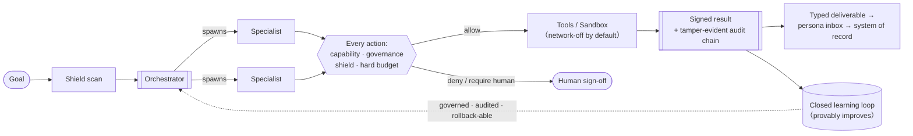

# Lightwork — Seed Deck

> **Audience:** pre-seed / seed investors (technical + enterprise-SaaS focused).
> **Format:** ~14 slides. Each slide below = the on-slide copy (terse) + speaker
> notes (what you *say*) + visual direction (what the designer builds).
> **Honesty rule:** every number here is real and verifiable, or marked `[FILL]`
> for facts only you know (ask, team, traction). Don't invent traction — at
> seed, an honest "alpha, installable today, here's the proof it works" beats a
> fabricated logo wall, and it survives diligence.

---

## Slide 1 — Title

**On slide:**
- **Lightwork**
- *The agent workforce a regulated enterprise can actually deploy.*
- Christopher Day, Founder · `[FILL: contact]` · `[FILL: month 2026]`

**Speaker notes:** "We let regulated enterprises put AI agents to work on real, high-stakes operations — finance, legal, healthcare ops — with the governance, audit trail, and *proof of improvement* that a bank or a hospital actually requires before an agent touches their systems."

**Visual:** Clean wordmark on dark. One line. A faint architecture watermark (the governance chokepoint) behind it.

---

## Slide 2 — The problem

**On slide:**
- Every enterprise wants an AI agent workforce. Almost none can deploy one where it matters.
- In regulated / high-stakes work, the blockers aren't capability — they're **governance, auditability, and trust**:
  - No proof an agent stayed in policy. No tamper-evident record. No way to prove it's getting *better*, not drifting.
  - Today's options force a bad trade: **hosted black boxes** you can't run on your own data, or **ungoverned frameworks** you have to secure yourself.

**Speaker notes:** "The agent demos are great. Then the CISO, the compliance officer, and the GC get in the room and it dies — because nobody can answer 'show me what it did, prove it couldn't exfiltrate our data, and prove it won't quietly get worse.' That gap is why agentic AI is stuck in pilots in exactly the industries that would pay the most for it."

**Visual:** A split: left "the demo" (slick), right "the diligence review" (a wall of red X's: no audit, no egress control, no proof). The chasm between them.

---

## Slide 3 — The solution

**On slide:**
- **Lightwork is a governed agent *runtime* — not a chatbot, not a framework.**
- A recursive multi-agent swarm where **every single action passes one chokepoint**: capability check → governance policy (allow / deny / require-human) → safety shield → hard budget → tamper-evident audit.
- **Self-host or air-gap.** Runs on the customer's data, in their environment. No required egress — an egress lock means even a successful prompt injection can't move data out.
- **A workforce that *provably* improves** — a closed, audited learning loop, not a static model.

**Speaker notes:** "We didn't build a smarter agent — frontier labs do that. We built the layer a regulated buyer needs *around* the agent: governance bound to every action, a signed audit log, self-hosting, and a learning loop you can prove. That's the part Sierra and LangChain don't ship and a bank can't build itself fast enough."

**Visual:** The hero diagram (see the Mermaid below — render it as a clean horizontal flow).

---

## Slide 4 — Why now

**On slide:**
- **Adoption inflection:** enterprise agentic AI is moving from pilots to budget — but stalling on governance.
- **Regulation is forcing the issue:** EU AI Act, sector rules (HIPAA, SOX, GLBA) make "ungoverned agent" a non-starter.
- **The money is in governance:** Gartner sizes AI-governance platforms at ~$492M (2026) → $1B+ by 2030, with AI regulation reaching 75% of economies by then.
- **The market just shifted to reward exactly us:** in 2026, *defensibility outweighs growth* — capital rewards IP-heavy companies and **punishes AI wrappers.** Lightwork is the opposite of a wrapper.

**Speaker notes:** "Two years ago the bet was 'who has the best agent.' In 2026 that's commoditizing — and investors have repriced accordingly, paying for defensible IP, not thin wrappers. Governance and provable safety are becoming a *requirement*, not a feature. We're early to the layer that becomes mandatory."

**Visual:** A timeline arrow (2024 capability race → 2026 governance + defensibility). One stat callout: "$492M → $1B+ AI-governance platforms (Gartner)."

---

## Slide 5 — Product (show, don't tell)

**On slide:**
- **One command produces a signed evidence bundle** — `maverick proof-pack`: governance guarantees, reliability cert, performance SLA, and shield results, Ed25519-signed and verifiable offline.
- **The governance is checkable, not claimed:** in a seeded demo, a finance specialist boots *sealed* (no shell, no payments), a $60k wire is **DENIED**, a $6k release **requires a human**, a runaway loop is **capped** — and altering one audited row is caught.
- **The work lands where humans sign off:** a goal's result renders as a typed deliverable → a per-role **inbox** → a human **certifies** it → it routes into Salesforce/ServiceNow (signed, audited).

**Speaker notes:** "This is the demo we run live. We don't say 'it's governed' — we run the Proof Pack and the golden-path scenario in front of you and you watch the platform refuse the dangerous action and leave a tamper-evident receipt. Then we show the deliverable get signed off and pushed into the system of record. That's the whole enterprise loop, closed."

**Visual:** 3 product screenshots in a row: (1) the signed `PROOF.md`, (2) the golden-path "receipts" table (SEALED / DENY / REQUIRE_HUMAN / CAPPED / TAMPER-EVIDENT), (3) the `/deliverables` persona inbox with an "Awaiting sign-off" item. *(I can generate these live from the real product.)*

---

## Slide 6 — The moat (why this is hard to copy)

**On slide:**
- **Governance bound to every action** — capability tokens (attenuate-only), policy engine, egress lock, and a **signed, hash-chained audit log** with offline verification. Not a wrapper — deep infra.
- **A workforce that provably improves** — an audited, snapshot-/rollback-able learning loop: offline consolidation ("dreaming"), per-department memory, and a causal "flywheel" that mines self-correcting guardrails from real outcomes. *Every causal claim must survive a placebo test before it changes behavior.*
- **1,118 prebuilt, least-privilege specialist packs across 26 suites** — `maverick domains-lint`: **0 errors, 0 warnings.** Run it yourself.
- **The thing a frontier lab won't ship into a bank:** a system that *rewrites itself in production* — governed, gated, and reversible.

**Speaker notes:** "Three compounding moats: the governance substrate, the provable-learning loop, and the 1,118-pack library — all audited. None of it is a prompt over an API; it's ~310,000 lines of infrastructure. A competitor doesn't catch up in a quarter, and an incumbent's hosted product can't be self-hosted into an air-gapped bank."

**Visual:** Three stacked "moat" bars (Governance · Provable learning · Governed library), each with a one-line proof underneath.

---

## Slide 7 — Market & wedge

**On slide:**
- **Bottom-up SOM:** ~10,000 US regulated financial institutions; 100 customers × ~$250k ACV ≈ $25M ARR from the BFSI beachhead. Gartner sizes AI-governance platforms at $1B+ by 2030.
- **Beachhead:** **BFSI / finance** — leads governance spend, highest regulatory pain, clearest ROI. (The finance suite already declares ~29 governed deliverables across 11 roles.)
- **Second wedge:** **tax-prep for CPA firms** — an unusually complete, deterministic, citation-backed pipeline (docs → first-pass 1040 + state return) with a signed tax-law update channel.
- **Expansion:** 26 suites already built — healthcare, insurance, legal, gov-contracting — land-and-expand once the wedge is proven.

**Speaker notes:** "We're not boiling the ocean despite having 26 suites built — we go deep in one regulated vertical where governance is the buying criterion, prove it, and expand into adjacent suites that already exist. Finance first because the pain and the budget are both highest."

**Visual:** A target: bullseye = BFSI; next ring = tax/insurance/healthcare; outer ring = the 26 suites. TAM numbers on the side.

---

## Slide 8 — Go-to-market

**On slide:**
- **Self-host removes the #1 enterprise blocker** — their data never leaves; procurement and security review get to "yes" faster.
- **Land via the wedge:** 2–3 design partners in BFSI → a paid pilot → expansion across suites.
- **An overlay wedge that avoids a rip-and-replace fight:** *"bring your existing Agentforce / Copilot / LangChain agents under Lightwork governance"* — we govern other people's agents (fleet memory + the audit/capability layer already do this). Easiest enterprise entry, and a natural acquisition story for a GRC/ServiceNow buyer.
- **Distribution surface already built:** 8 PyPI packages, Docker/K8s/VPS, an MCP server (drives from Claude Code / Cursor / any MCP client), GitHub Action.

**Speaker notes:** "Two motions. Direct: land a regulated design partner and go deep. Overlay: we don't have to displace their agent platform — we wrap it in governance, which is a far easier sale and the wedge that makes us strategically valuable to an incumbent."

**Visual:** Two arrows — "Direct (deep in one vertical)" and "Overlay (govern their agents)" — converging on "expand."

---

## Slide 9 — Business model

**On slide:**
- **Annual platform license, self-hosted** — priced per deployment and seat-band. Land with one governed workflow.
- **Land → expand:** pilot → production workflow → adjacent suites. 26 suites already built means expansion is a config change, not a new sale — net revenue retention by design.
- **Why it compounds:** self-host + signed audit + the learning loop = high switching cost; software gross margins. The overlay motion (govern others' agents) adds a second revenue line.
- Pricing scales with **governed surface area** — seats, agents, and suites under management. `[FILL: pilot price · production ACV band]`

**Speaker notes:** "We sell an annual platform license, self-hosted, so the buyer's data never leaves. We land on one governed workflow and expand across the 26 suites that are already built — expansion is a config change, not a new sale. Self-host plus a signed audit trail and a learning loop make us very sticky, at software margins."

**Visual:** Three cards — How we charge · Land → expand · Why it compounds.

---

## Slide 10 — Competition

**On slide:**

| | Governance + audit | Self-host / air-gap | Provable learning | Prebuilt regulated specialists |
|---|:--:|:--:|:--:|:--:|
| **Lightwork** | ✅ signed, hash-chained | ✅ | ✅ | ✅ 1,118 |
| Sierra ($15.8B, CX agents) | partial | ❌ hosted | ❌ | ❌ |
| Cognition / Devin (coding) | ❌ | ❌ | ❌ | ❌ |
| LangChain (framework) | ❌ DIY | ✅ but DIY | ❌ | ❌ |
| ServiceNow / Salesforce | policy, not agent-native | ❌ | ❌ | ❌ |

- **We don't compete on the runtime** (a commoditizing race) — we compete on the **governance + provable-learning layer no one else ships.**

**Speaker notes:** "Sierra is brilliant at hosted customer-experience agents — different buyer, can't air-gap. Cognition is coding. LangChain is ungoverned plumbing you secure yourself. The incumbents have policy but not an agent-native governed runtime. Nobody owns 'governed, self-hostable, provably-improving agent workforce for regulated work.' That's the lane."

**Visual:** The table above, Lightwork's row highlighted. Footer: "We govern the agents; we don't race to build a smarter one."

---

## Slide 11 — Traction & what's built

**On slide:**
- **Built and installable today (alpha):** ~310K LOC across 8 packages on PyPI, native installers for Win/macOS/Linux, self-host or air-gap.
- **The product proves itself:** signed Proof Pack, the governance guarantees scoreboard, 1,118 lint-clean packs (0 errors).
- **Design partners / pilots:** `[FILL: e.g. "2 BFSI design partners in conversation; 1 signed LOI"]`
- **Revenue:** `[FILL: pre-revenue / $X MRR / pilot value]`
- **Roadmap to the milestone this round buys:** 3 design partners live · SOC 2 Type I in progress · first paid ARR.

**Speaker notes (be honest):** "We're pre-revenue and alpha — and unusually far along on *substance*: the hard infrastructure is built and tested, and the product can prove its own guarantees on the spot. What this round buys is the validation layer — design partners, SOC 2, first ARR — that turns a strong asset into a company."

**Visual:** Two columns — "Built (✅ checklist)" vs "Next 12 months (→ milestones)". Big honest stat: "~310K LOC, installable today."

---

## Slide 12 — Team

**On slide:**
- **Christopher Day**, Founder — `[FILL: one-line credibility — prior company / domain / why-you]`
- `[FILL: any co-founders / key hires / advisors]`
- **Why us:** `[FILL: the unfair advantage — domain access, prior exit, depth in regulated AI]`

**Speaker notes:** `[FILL: the founder story — the "why I'm the person to build this and the unfair insight/access I have." This slide carries a seed round; make the why-you specific.]`

**Visual:** Headshot(s) + 1-line bios. Keep it tight and credible.

---

## Slide 13 — The ask

**On slide:**
- **Raising `[FILL: $X]` at `[FILL: $Y pre-money]`.**
- **Use of funds (12–18 mo):** `[FILL: e.g. 2 eng hires · design-partner success · SOC 2 + pen test · GTM]`.
- **Milestones this funds:** 3 design partners live → first paid ARR → SOC 2 Type I → a fundable Series A story.

**Speaker notes:** "We're raising `[$X]` to convert a built, defensible asset into a revenue-generating company: land design partners, get the SOC 2 a regulated buyer requires, and turn on the first ARR. For context, the 2026 market is pricing defensible, IP-heavy seed companies in the `[$8–20M pre-money]` range — and that's *before* the traction this round delivers."

**Visual:** One big number (the ask) + a simple use-of-funds donut + a 3-milestone timeline.

---

## Slide 14 — Vision

**On slide:**
- **The AI workforce of record for regulated enterprises.**
- A governed, self-improving agent workforce that does real operational work — and can *prove*, to a regulator, that it stayed in policy and got better.
- Start: one regulated vertical. End: the governance + learning layer every enterprise agent runs through.

**Speaker notes:** "Agents are going to do enterprise work — the only question in regulated industries is whose governance and proof layer they run through. We intend that to be Lightwork."

**Visual:** The hero diagram again, simplified, with the tagline. Contact / `[FILL: data room link]`.

---

## Design direction (for the visual build)
- **Tone:** enterprise-serious, not playful. Dark or near-white, one accent color, lots of whitespace. Think "infrastructure / security company," not "consumer app."
- **Recurring motif:** the *governance chokepoint* (every action through one gate) — reuse it as a visual thread across slides 3, 6, 13.
- **Every claim gets a proof artifact** where possible (a real screenshot, a real command, a real number) — the credibility *is* the design.
- **Diagrams:** the hero flow (slide 3), the moat stack (6), the market bullseye (7), the competition table (9). I can render the hero + flywheel diagrams in Figma (MCP connected) or as clean SVGs.

## What I need from you to finalize (the `[FILL]`s)
1. **The ask:** amount + target pre-money (I gave the market-grounded $8–20M range as a default to react to).
2. **Team:** your name, one-line bio + the "why you," any co-founders/advisors.
3. **Traction:** any design-partner conversations, LOIs, pilots, or revenue — even "0, here's the pipeline" is fine and honest.
4. **Logo / brand:** if you have one; otherwise I'll spec a clean placeholder.
